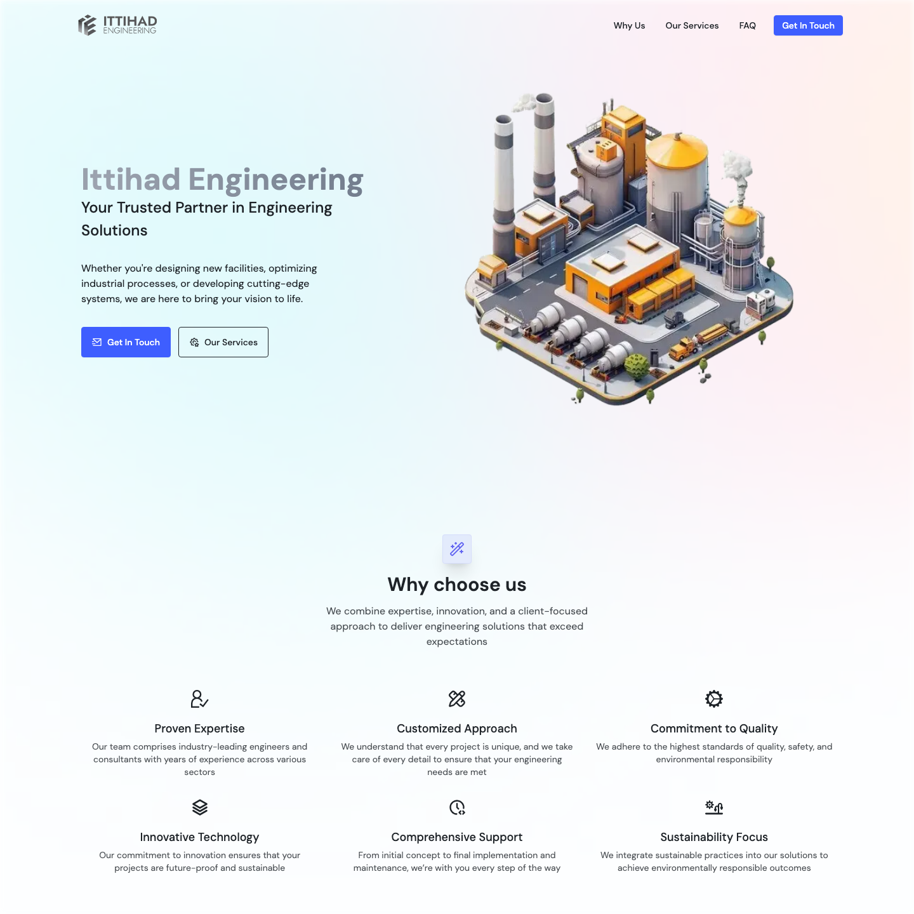
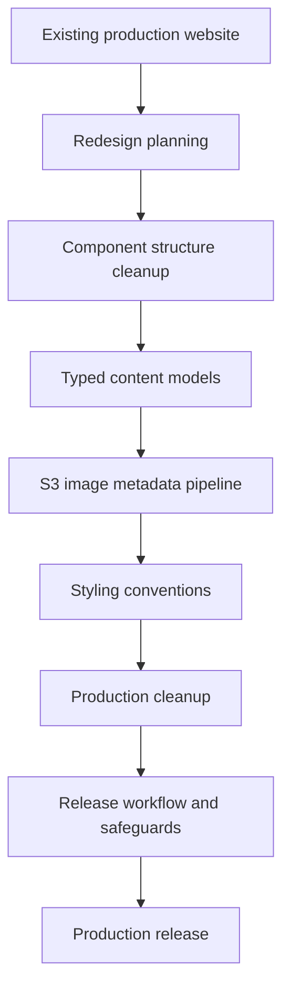
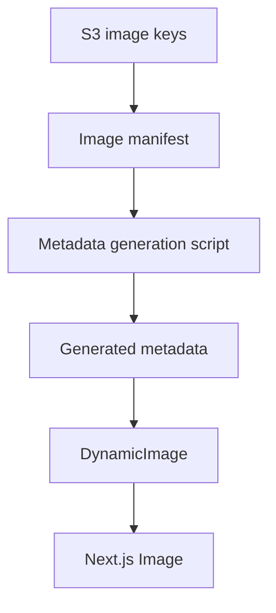

# From Redesign to Production: Ittihad Engineering

## Table of Contents

- [Executive Summary](#executive-summary)
- [The Project](#the-project)
- [Engineering Goals](#engineering-goals)
- [How the Project Evolved](#how-the-project-evolved)
  - [Maintainability](#maintainability)
  - [Image Management](#image-management)
  - [Styling Strategy](#styling-strategy)
  - [Production Readiness](#production-readiness)
  - [Cleanup and Long-Term Ownership](#cleanup-and-long-term-ownership)
- [Outcome](#outcome)
- [What the Project Reinforced](#what-the-project-reinforced)
- [What I Would Improve Next](#what-i-would-improve-next)

## Executive Summary

I led the redesign and production release of the Ittihad Engineering website, a
real public business site built with Next.js App Router, React, TypeScript, CSS
Modules, Tailwind utilities, and S3-hosted image assets.

The work went beyond visual polish. I improved the frontend structure, refined
content organization, rebuilt the image handling flow around build-time S3
metadata generation, cleaned stale implementation paths, documented release
workflow, and shipped the redesigned site to production.

The production repository is private because it supports a real business. This
case study focuses on the public engineering story without exposing sensitive
business details, deployment internals, secrets, or unnecessary source-code
specifics.

## The Project

Ittihad Engineering needed a stronger public website that reflected the company
more clearly and could be maintained safely after launch. The existing site was
already live, so the redesign had to respect production constraints while
improving the codebase around it.

| Project detail | Summary |
| --- | --- |
| Role | Frontend engineering, redesign implementation, and production release |
| Scope | Frontend structure, image pipeline, styling, cleanup, and release safety |
| Stack | Next.js App Router, React, TypeScript, CSS Modules, and Tailwind utilities |
| Assets | S3-hosted images with build-time metadata generation |
| Deployment | Netlify-hosted production deployment |
| Live site | [ittihad.engineering](https://ittihad.engineering/) |

The site is structured as a focused single-page business website with dedicated
sections for the landing hero, services, partners, FAQ, contact, footer, and
supporting UI.

### Before / After

| Before redesign | After redesign |
| --- | --- |
| [](https://deploy-preview-55--ittihad-engineering.netlify.app/) | [](https://ittihad.engineering/) |

Both screenshots use the same viewport and capture settings for a consistent
comparison. Each image links to the corresponding public version.

## Engineering Goals

The redesign had several practical engineering goals:

- Improve maintainability without overbuilding the architecture.
- Keep section-specific code easy to locate and change.
- Move public content into typed data structures where useful.
- Make S3 image rendering predictable and production-safe.
- Preserve CSS Modules for meaningful component structure.
- Use Tailwind utilities only where they simplified small local styling.
- Hide unfinished content through configuration instead of comments.
- Remove stale dependencies, unused code, and redundant styling.
- Document release workflow, smoke testing, versioning, tagging, and rollback.
- Add local safeguards against accidental production pushes.

## How the Project Evolved



The project evolved from a visual redesign into a broader production-readiness
effort. Each pass made the site easier to reason about, safer to release, or
more predictable to maintain.

### Maintainability

The redesign moved major sections into clear component folders:

- `HeroLanding`
- `Navbar`
- `Services`
- `WhyUs`
- `Partners`
- `FAQ`
- `Contact`
- `Footer`
- `ToTopButton`

Shared UI stayed small and purposeful:

- `Button`
- `Card`
- `DynamicImage`
- `Icon`
- `Input`
- `Section`
- `SectionHeader`
- `Toast`

This avoided a large premature design system while still removing repeated
patterns. Section-specific layout stayed colocated with the component through
CSS Modules, while reusable primitives stayed in shared components or global
CSS.

Content-heavy areas were also moved into typed data structures. That made
services, partners, FAQ entries, contact details, and footer content easier to
review without digging through JSX.

The examples below are shortened and sanitized to show the implementation
patterns without reproducing private source code.

```ts
export const SERVICES_FOOTER = {
  isVisible: false,
  eyebrow: 'Product & supply catalogue',
  title: 'Browse industrial products and accessories',
  cta: {
    label: 'View catalogue',
    catalogKey: S3_IMAGE_KEYS.PRODUCT_CATALOG,
  },
} as const satisfies ServicesFooter;
```

This pattern also helped with production content gating. Content that was not
ready for release could stay in the codebase without being visible in
production.

### Image Management

Image handling became one of the most important engineering parts of the
redesign. The site uses public S3-hosted assets, but raw remote image URLs alone
were not enough. The implementation needed predictable dimensions, blur
placeholders, typed image keys, and safe runtime behavior.

The final image flow uses typed S3 keys, a manifest, a build-time metadata
generation script, generated metadata, and a shared `DynamicImage` component.



Centralized S3 keys provide a typed vocabulary shared by the manifest,
generated metadata, content models, and rendering components.

The build-time script fetches each manifest image, extracts dimensions, and
creates a small blur placeholder:

```ts
const getImageMetadata = async (
  s3BucketUrl: string,
  item: ImageManifestItem,
) => {
  const src = getImageUrl(item.key, item.folder, s3BucketUrl);
  const imageBuffer = await fetchImageBuffer(src);
  const metadata = await sharp(imageBuffer).metadata();

  if (!metadata.width || !metadata.height) {
    throw new Error(`Unable to read image dimensions: ${src}`);
  }

  const blurBuffer = await sharp(imageBuffer)
    .resize({ width: 10, withoutEnlargement: true })
    .blur()
    .webp({ quality: 40 })
    .toBuffer();

  return {
    src,
    width: metadata.width,
    height: metadata.height,
    blurDataURL: `data:image/webp;base64,${blurBuffer.toString('base64')}`,
    alt: item.alt ?? '',
  };
};
```

At runtime, image rendering stays small and predictable:

```tsx
type DynamicImageProps = {
  imageKey: S3ImageKey;
  altText?: string;
  preload?: boolean;
  className?: string;
  sizes?: string;
};

function DynamicImage({
  imageKey,
  altText,
  preload = false,
  className,
  sizes,
}: DynamicImageProps) {
  const image = s3ImageMetadata[imageKey];

  if (!image) {
    return altText ? <span data-missing-image>{altText}</span> : null;
  }

  return (
    <Image
      src={image.src}
      alt={altText ?? image.alt}
      width={image.width}
      height={image.height}
      placeholder="blur"
      blurDataURL={image.blurDataURL}
      preload={preload}
      className={className}
      sizes={sizes}
    />
  );
}
```

I also reviewed image priority behavior and replaced older `priority` usage with
the current `preload` behavior where appropriate. Preload is used only for the
primary hero image, not for logos or secondary images. That keeps early network
priority focused instead of treating every visible asset as critical.

### Styling Strategy

The redesign did not use a full styling rewrite. Instead, it kept a clear
boundary between styling layers:

- Global CSS for tokens, base styles, and reusable primitives.
- CSS Modules for component-specific structure and responsive section behavior.
- Tailwind utilities for simple local layout, sizing, and spacing.

This was a deliberate maintainability decision. Some CSS Module classes were
small, but they still represented meaningful parts of a section. Those stayed as
named classes because they made the JSX easier to understand.

Tailwind utilities were used only where they reduced noise without changing the
structure of the component.

### Production Readiness

The release work covered more than build success. I added documentation for:

- Branch flow
- Production build checks
- S3 image metadata verification
- Required environment variables
- Netlify deployment flow
- Smoke testing
- Versioning
- Tagging
- Rollback
- Local Git push safeguards

The image metadata generation is part of the build path:

```json
{
  "prebuild": "npm run generate:images",
  "generate:images": "tsx scripts/generate-s3-image-metadata.ts",
  "build": "next build"
}
```

This makes the image pipeline part of release preparation instead of a separate
manual step. Because Netlify runs the production build, the `prebuild` step also
regenerates S3 image metadata during deployment.

The trade-off is that metadata generation depends on the asset source being
available and the manifest remaining valid during a clean build. I accepted
that dependency because an explicit build failure is safer than deploying
missing dimensions or stale image metadata.

I also added a repo-specific local `pre-push` guard to reduce the risk of
accidentally pushing from local `master` to the production remote. This is not a
replacement for hosted branch protection, but it is a practical safeguard for a
private production website.

### Cleanup and Long-Term Ownership

The final phase focused on removing release risk and future confusion:

- Removed stale components and unused constants.
- Removed old DaisyUI references and unused theme configuration.
- Removed unused images and background patterns.
- Cleaned redundant styles.
- Documented S3 image handling.
- Documented styling conventions.
- Documented release workflow.
- Kept unfinished production content hidden through configuration.

This cleanup mattered because redesign projects can easily leave behind two
versions of the same idea: the old implementation and the new one. Removing
unused paths made the production codebase easier to maintain after launch.

## Outcome

The redesigned Ittihad Engineering website was successfully released to
production.

The final release had:

- Clearer section ownership.
- A smaller and more purposeful shared UI layer.
- Typed content models for core page data.
- S3 image rendering backed by generated metadata.
- Selective image preloading.
- Documented styling conventions.
- Production content gating through configuration.
- Netlify-hosted production deployment.
- Release workflow documentation.
- Local Git safeguards for production push risk.

The strongest outcome was not a single feature. It was a production-ready
frontend that became easier to understand, safer to change, and more deliberate
about assets, styling, and release process.

## What the Project Reinforced

### Production Polish Is Not Only Visual

The most important release work happened around structure, content ownership,
image handling, cleanup, and documentation. Visual polish mattered, but the
production value came from making the site easier to operate and maintain.

### Image Handling Deserves Early Design

Remote images can look simple until dimensions, blur placeholders, priority,
fallbacks, and asset naming need to work consistently. Moving metadata
generation to build time made the runtime component simpler and more reliable.

### Styling Needs Ownership Rules

Using CSS Modules and Tailwind together can work well, but only if the project
has clear boundaries. Without documented rules, styling choices become
subjective and inconsistent.

### Configuration Is Better Than Comments for Release State

Hiding unfinished content through typed data made the production state explicit.
That was cleaner than commented-out JSX and safer than deleting future-ready
content entirely.

### Release Documentation Is Engineering Work

The release workflow, smoke test checklist, versioning notes, and rollback plan
made future releases less dependent on memory. For a real production site, that
is part of the engineering deliverable.

## What I Would Improve Next

Given more time, I would add:

- A dedicated quality gate before production deployment, covering linting, build
  verification, generated image metadata drift, basic accessibility checks, and
  smoke tests.
