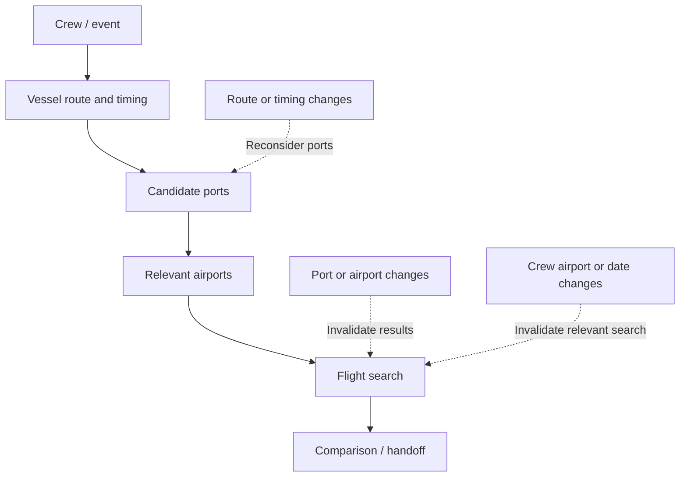
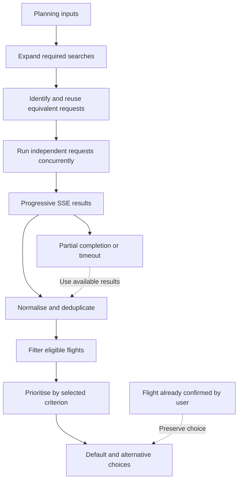
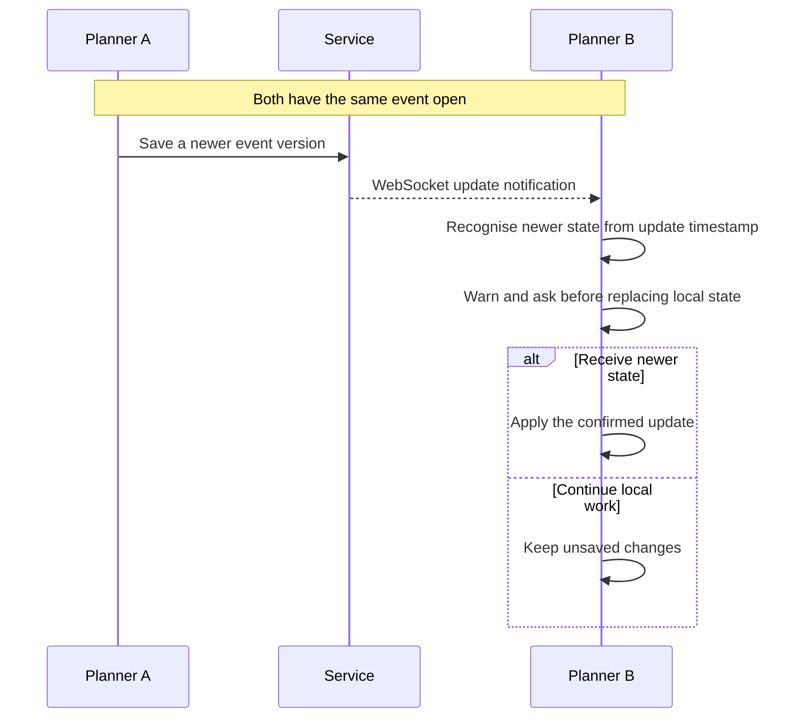

# Building a dependable crew-change planning workflow at Greywing

Greywing developed software for maritime operations. One of its central products
helped shipping-company crew managers plan a crew change: decide who would join
or leave a vessel, where the change could happen, how people would travel, and
how to hand the plan on. I worked at Greywing from January 2022 to March 2024.
During that period, I was the principal frontend engineer for the development of
two crew-planning modules, Crew Change Planning and Crew Matrix Planning. I led
much of their production frontend design and implementation. The CEO and CTO set
broader product direction, and the backend lead developed supporting APIs in
discussion with me.

**Note on confidentiality:** This account describes my Greywing work at a high
level. Proprietary source code, internal implementation details, customer
information, production data and product screenshots have been intentionally
omitted. The diagrams are simplified, original explanations rather than
depictions of the product.

## Table of Contents

- [The planning problem](#the-planning-problem)
- [Keeping a dependent workflow coherent](#keeping-a-dependent-workflow-coherent)
- [Progressive flight search](#progressive-flight-search)
- [Reliability and delivery](#reliability-and-delivery)
- [A second planning problem: Crew Matrix](#a-second-planning-problem-crew-matrix)
- [What I would carry forward](#what-i-would-carry-forward)

## The planning problem

A crew change is a chain of related decisions. The people involved and the
vessel's route and timing narrow the candidate ports, but a port choice also
needs to be considered alongside crew travel. For crew members who needed
flights, each selected port led to searches between its relevant airport and
their selected airports. Flight availability could then change how a crew
manager assessed the ports. The planner needed to help users compare workable
port-and-flight combinations while allowing them to revisit earlier choices. If
a date or port changed, a flight selected under the old conditions could no
longer be treated as current.

The frontend combined crew, vessel, port, airport and travel information from
different services. Those sources did not always provide equally complete or
consistently shaped data. The interface had to distinguish missing information
from a genuine lack of available options, and an unfinished search from a
completed search with no useful result. This required a planning model and
explicit fallback states, not only forms and tables.

The plan also had a life beyond the open screen. An early requirement to save a
report for later communication grew into read-only access, reopening and
editing, comparison, export and partially saved plans. These requirements
accumulated as the product evolved. Each extension meant reconstructing a
coherent planning state from saved data as well as supporting the live workflow.

_Planning dependencies: each stage narrows the next set of choices; dotted
arrows show how earlier changes can invalidate downstream results. This is a
conceptual flow, not the product interface._

## Keeping a dependent workflow coherent

The planner progressively assembled a plan across crew, route, ports, flights
and final comparison or handoff. Each stage used decisions from earlier stages.
I worked on the frontend model, state transitions, validation and interaction
logic that allowed users to move forwards and back without presenting stale
downstream choices as valid. For example, a changed departure date needed to
affect the relevant flight results; a changed port could affect the travel
choices available for comparison.

The state architecture grew with the product. The application initially used
React Context; as it expanded, I introduced Redux for resources shared across
features. The active planning session used feature-level Context and reducers,
while short-lived controls stayed local to components. This divided state by its
purpose and lifetime. It also created a cost: settings, saved-plan
reconstruction, flight results and the current step could cross those
boundaries. Reset and synchronisation rules mattered whenever a user changed an
earlier choice or reopened a plan. The arrangement evolved incrementally rather
than from one up-front design.

Some of the hardest frontend work lay between services and interactions. The
planner adapted incomplete crew, port and airport information into usable
feature data, with fallbacks where an expected value was absent. It coordinated
editable tables and planner-specific map interactions so a port choice had the
same meaning in both places. My map work integrated the planner with Greywing's
shared map and routing infrastructure. The table-based workflow was useful for
inspecting many candidate choices, but it also required care around selection,
validation and derived data as the plan changed.

One-Click Crew Change added a second path through the same workflow. The CEO and
CTO proposed the concept; I implemented much of its frontend orchestration and
later refinements. It selected eligible organisation-preferred ports on the
vessel route and continued through the normal flight-selection path, using the
current planning criteria. Automation had to check that prerequisite information
was available, represent progress and stop when it could not continue. Users
could stop it and review the choices made in individual steps. The automated
path therefore remained tied to the same planning decisions as the manual one.

## Progressive flight search

Flight search exposed the limits of the early approach most clearly. Searches
were initially more sequential. As the planner added the option to consider
multiple ports for each crew member, the amount of independent search work
increased and waiting for everything to finish became noticeable. We wanted
useful options to appear as soon as they were available, while still showing
what remained in progress.

The frontend first had to turn planning choices into the searches actually
needed. A crew member, a candidate port, travel direction and date could produce
a distinct search, but different parts of a plan could also require equivalent
work. I implemented request identification and reuse so an equivalent search did
not automatically mean another network call. The identity needed to be precise:
reuse is helpful only while the inputs that determine a search still match.
Changing a date, for instance, must not leave results from the old date looking
current.

Independent work could then run concurrently rather than one search blocking the
next. The backend lead chose Server-Sent Events (SSE) for progressive delivery
from the flight service. My frontend work connected that stream to the planner's
request and progress state, allowing arriving options to become available before
all searches had finished. The backend aggregated external providers and handled
provider-specific reliability concerns. On the frontend, I modelled the request,
progress, partial-result and timeout states exposed to the planner.

Results arriving over time still needed to be useful together. The frontend
normalised returned flight information into a form the planning workflow could
compare, associated it with the relevant crew and port decisions, and removed
duplicate options. It needed separate representations for pending work,
completed work, partial results, unavailable options and cases where a flight
was unnecessary. A blank area could otherwise mean too many different things.

Within each selected port, step-level filters narrowed flights against travel
and vessel-timing constraints. The user could prioritise cost, journey time or
CO₂. The frontend ordered eligible flights by that active category and surfaced
the highest-priority match as a default for each crew member, while preserving
flights already confirmed. “Best flight” was therefore relative to the current
criterion, and users could inspect alternatives or change the selection. Those
port-specific flight choices, alongside availability and cost information,
helped users compare the wider port-and-travel plans.

As the result set and filtering needs grew, keeping every flight row in ordinary
React or Redux state was increasingly awkward. State changes could also trigger
avoidable refetching. The CTO suggested exploring a browser-side query layer for
the growing result set. I researched and tried possible approaches, then chose
AlaSQL and implemented it as the planner's local query layer. It kept fetched
rows available for local filtering and reuse, while tracking which search work
had completed. This introduced another state authority outside React: the query
layer, request progress and active plan had to stay aligned, and the browser had
to manage the lifetime and memory cost of stored results.

Progressive delivery made incomplete outcomes a product decision as well as a
technical state. A timeout could let the user continue with the results already
available instead of waiting indefinitely, but the partial set might omit a more
suitable option that would have arrived later. The interface therefore had to
expose progress and partial completion rather than silently treating an
interrupted search as exhaustive. Together, these mechanisms made usable results
available before every search completed and avoided repeating equivalent work.

_Progressive flight search: concurrent searches returned incrementally. The
planner normalised available results, then prioritised eligible flights under
the selected criterion; partial results and confirmed choices remained
explicit._

## Reliability and delivery

Persisted plans added a separate reliability boundary. TypeScript describes the
data expected while code is running, but it cannot guarantee that an older or
incomplete saved plan has the shape the current frontend expects. The planner
used runtime validation before reconstructing shared or read-only plans. This
did not eliminate all compatibility work, but it made the point at which
external or persisted data entered the active planning model explicit. The same
principle applied to streamed searches: partial, timed-out and unavailable
results needed their own states instead of being collapsed into one generic
error.

The integrated workflow was cumbersome to verify solely by hand. I proposed a
Playwright end-to-end approach and implemented its core setup, reusable
authenticated test support and much of the crew-planning coverage. The tests
exercised journeys such as progressing through planning, changing earlier
choices, saving and reopening plans, and using One-Click. They ran in CI, giving
us repeatable checks across parts of the frontend and service integration that
isolated component tests would not exercise together. I also broke larger
feature requests into smaller frontend deliverables as requirements developed.

Greywing was a fast-moving product with changing requirements and limited
delivery time, so much of the testing effort concentrated on integrated journeys
rather than a broad unit-test suite. Recorded network fixtures were introduced
later in response to long execution and build times and the cost of repeated API
calls. They helped make runs more repeatable, but fixture maintenance and a
large E2E suite have their own costs. Looking back, I would keep a smaller set
of critical workflow tests and put more of the domain logic under focused
unit-level tests.

## A second planning problem: Crew Matrix

Crew Matrix addressed a different point in the crew-planning process: managing
crew information and preparing changes across vessels. I developed much of its
substantive production frontend as requirements evolved, including ways to
examine a proposed crew change and its effect on the resulting crew. The backend
lead developed the supporting APIs, while I implemented the frontend workflow
around them.

Concurrent editing was a distinct correctness problem. Two planners could work
on the same event, and a version conflict or later remote update could make one
person's open view stale. The frontend used update timestamps alongside
WebSocket notifications to become aware of changed event state. I implemented
the frontend handling around those timestamps, notifications and the
confirmation flow for receiving newer state. It did not silently replace an
active local plan when a remote change arrived: the user was asked to confirm
before receiving the newer state, protecting unsaved local work. Correctness
depended on representing a state the user needed to understand, not just
refreshing data in the background.

_Concurrent editing: a remote update was surfaced to the active planner, who
chose whether to receive newer state instead of having unsaved work silently
replaced. This shows the conceptual interaction, not an internal protocol._

## What I would carry forward

I would keep explicit partial states, the table-based comparison where it suited
dense planning data, planner-to-map synchronisation, and end-to-end coverage for
the few journeys where integration really matters. The most useful architectural
lesson for me is that dependent decisions and their invalidation rules need
visible ownership. When data, settings, local results and saved plans all affect
the same decision, an unclear boundary becomes a source of complexity even if
each individual component is straightforward.

With today's perspective, I would make those boundaries easier to test: smaller
API modules, clearer feature structure, more domain-level unit tests and a more
focused E2E suite. These are adjustments to an architecture that grew with the
product. A dependable planning frontend needs to make incomplete information,
changing decisions and ownership of state explicit to both the code and the
person using it.
